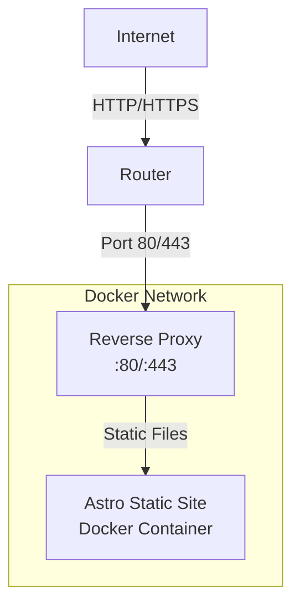

# Self-Hosted Astro Website with Docker and Nginx

## Project Overview

You have an Astro-based portfolio website configured for **static output**, which makes it perfect for simple, fast hosting. This plan outlines how to containerize your site with Docker and use Nginx as a reverse proxy.

## Architecture Diagram



## Goals

1. Containerize the Astro website using Docker
2. Configure Nginx as a reverse proxy
3. Orchestrate with Docker Compose
4. Optimize for production
5. Test locally before deployment

## Implementation Plan

### Step 1: Create Dockerfile for Astro Site

We'll use a multi-stage Docker build to optimize the image:

```dockerfile
# Build stage
FROM node:20-alpine AS builder
WORKDIR /app

# Copy package files
COPY package*.json ./
COPY pnpm-lock.yaml* ./

# Install dependencies
RUN npm install -g pnpm && pnpm install --frozen-lockfile

# Copy source files
COPY . .

# Build the Astro site
RUN pnpm run build

# Production stage
FROM nginx:alpine
WORKDIR /usr/share/nginx/html

# Copy built files from builder
COPY --from=builder /app/dist .

# Copy custom Nginx config
COPY nginx.conf /etc/nginx/nginx.conf

EXPOSE 80
CMD ["nginx", "-g", "daemon off;"]
```

### Step 2: Create Nginx Configuration

Create `nginx.conf` for reverse proxy and static file serving:

```nginx
events {
    worker_connections 1024;
}

http {
    include       /etc/nginx/mime.types;
    default_type  application/octet-stream;

    # Logging configuration
    access_log /var/log/nginx/access.log;
    error_log /var/log/nginx/error.log;

    # Gzip compression
    gzip on;
    gzip_vary on;
    gzip_min_length 1024;
    gzip_types
        text/plain
        text/css
        text/xml
        text/javascript
        application/javascript
        application/xml+rss
        application/json;

    server {
        listen 80;
        server_name yourdomain.com www.yourdomain.com;

        # Root directory for static files
        root /usr/share/nginx/html;
        index index.html index.htm;

        # Enable compression
        gzip_static on;
        gunzip_static on;

        # Serve static files
        location / {
            try_files $uri $uri/ /index.html;
        }

        # Cache static assets
        location ~* \.(js|css|png|jpg|jpeg|gif|ico|svg|woff|woff2|ttf|eot)$ {
            expires 1y;
            add_header Cache-Control "public, immutable";
        }

        # Security headers
        add_header X-Frame-Options "SAMEORIGIN" always;
        add_header X-Content-Type-Options "nosniff" always;
        add_header X-XSS-Protection "1; mode=block" always;
        add_header Referrer-Policy "no-referrer-when-downgrade" always;
        add_header Content-Security-Policy "default-src 'self' http: https: data: blob: 'unsafe-inline'" always;
    }
}
```

### Step 3: Create Docker Compose File

Create `docker-compose.yml` for easy orchestration:

```yaml
version: "3.8"

services:
  nginx:
    build: .
    container_name: astro-nginx
    ports:
      - "80:80"
      - "443:443"
    restart: unless-stopped
    volumes:
      # Optional: For SSL certificates and logs
      # - ./ssl:/etc/nginx/ssl
      # - ./logs:/var/log/nginx
    networks:
      - astro-network

networks:
  astro-network:
    driver: bridge
```

### Step 4: Update Astro Configuration

Modify `astro.config.mjs` with your actual domain:

```javascript
// @ts-check
import { defineConfig } from "astro/config";

import tailwind from "@astrojs/tailwind";
import mdx from "@astrojs/mdx";

export default defineConfig({
  integrations: [tailwind(), mdx()],

  output: "static",

  // Replace with your actual domain
  site: "https://yourdomain.com",
  base: "/",

  server: {
    port: 3000,
    host: "0.0.0.0",
  },
});
```

### Step 5: Create .dockerignore

Prevent unnecessary files from being included in the build:

```
node_modules
.git
.gitignore
README.md
*.log
.DS_Store
.vscode
screenshots
reference
move
```

### Step 6: Test Locally

1. Build and start the containers:

   ```bash
   docker-compose up -d --build
   ```

2. Verify the site is running:
   - Open browser to `http://localhost`
   - Check container status: `docker-compose ps`

3. View logs:

   ```bash
   docker-compose logs -f
   ```

4. Stop containers:
   ```bash
   docker-compose down
   ```

### Step 7: Production Deployment

#### Prerequisites

- A domain name pointing to your public IP
- Port 80 and 443 open on your router
- SSL certificate (Let's Encrypt recommended)

#### Deploying SSL (Let's Encrypt)

1. Stop existing containers:

   ```bash
   docker-compose down
   ```

2. Obtain SSL certificate:

   ```bash
   docker run -it --rm \
     -v ./ssl:/etc/letsencrypt \
     -v ./ssl/logs:/var/log/letsencrypt \
     certbot/certbot certonly --standalone \
     --email your@email.com \
     --domains yourdomain.com,www.yourdomain.com \
     --agree-tos
   ```

3. Modify nginx.conf for HTTPS:

   ```nginx
   server {
       listen 80;
       server_name yourdomain.com www.yourdomain.com;
       return 301 https://$server_name$request_uri;
   }

   server {
       listen 443 ssl http2;
       server_name yourdomain.com www.yourdomain.com;

       ssl_certificate /etc/nginx/ssl/live/yourdomain.com/fullchain.pem;
       ssl_certificate_key /etc/nginx/ssl/live/yourdomain.com/privkey.pem;

       # SSL configuration...
       ssl_protocols TLSv1.2 TLSv1.3;
       ssl_ciphers HIGH:!aNULL:!MD5;
       ssl_prefer_server_ciphers off;

       # Rest of configuration remains the same...
   }
   ```

4. Update docker-compose.yml to include SSL volume:

   ```yaml
   services:
     nginx:
       volumes:
         - ./ssl:/etc/nginx/ssl
         - ./logs:/var/log/nginx
   ```

5. Restart containers:
   ```bash
   docker-compose up -d
   ```

### Step 8: Create Maintenance Scripts

#### Health Check Script (`healthcheck.sh`)

```bash
#!/bin/bash

URL="http://localhost"
EXPECTED="Portfolio"

if curl -s "$URL" | grep -q "$EXPECTED"; then
    echo "✅ Website is running correctly"
    exit 0
else
    echo "❌ Website is not responding correctly"
    exit 1
fi
```

#### Backup Script (`backup.sh`)

```bash
#!/bin/bash

BACKUP_DIR="./backups"
TIMESTAMP=$(date +"%Y%m%d_%H%M%S")

mkdir -p "$BACKUP_DIR"

# Backup Docker volumes
docker run --rm -v astro-portfolio_nginx:/volume -v "$BACKUP_DIR":/backup \
  alpine tar czf /backup/nginx_${TIMESTAMP}.tar.gz -C /volume .

# Backup SSL certificates
if [ -d "./ssl" ]; then
    tar czf "$BACKUP_DIR"/ssl_${TIMESTAMP}.tar.gz -C ./ssl .
fi

echo "✅ Backup completed: $BACKUP_DIR"
```

### Step 9: Monitoring and Maintenance

#### Log Monitoring

```bash
# View Nginx access logs
docker exec astro-nginx tail -f /var/log/nginx/access.log

# View Nginx error logs
docker exec astro-nginx tail -f /var/log/nginx/error.log

# Analyze traffic patterns
awk '{print $1}' logs/access.log | sort | uniq -c | sort -rn | head -20
```

#### Performance Tuning

1. **Increase worker connections in nginx.conf:**

   ```nginx
   events {
       worker_connections 2048;
   }
   ```

2. **Enable HTTP/2:**
   ```nginx
   listen 443 ssl http2;
   ```

### Troubleshooting Guide

#### Common Issues

1. **Container won't start**

   ```bash
   # Check logs
   docker-compose logs nginx

   # Verify Dockerfile syntax
   docker build -t test-image .

   # Check port conflicts
   netstat -tuln | grep -E ':(80|443)\s'
   ```

2. **502 Bad Gateway**
   - Check container status: `docker-compose ps`
   - Verify Nginx configuration: `nginx -t` inside container
   - Check network connectivity: `docker exec astro-nginx ping astro-app`

3. **SSL Certificate Issues**
   - Check certificate validity:
     ```bash
     openssl x509 -in ssl/live/yourdomain.com/cert.pem -text -noout
     ```
   - Renew certificate:
     ```bash
     docker run --rm -v ./ssl:/etc/letsencrypt certbot/certbot renew
     ```

### Security Best Practices

1. **Keep Docker Images Updated:**

   ```bash
   docker pull nginx:alpine
   docker pull node:20-alpine
   docker-compose down
   docker-compose up -d --build
   ```

2. **Limit Container Privileges:**

   ```yaml
   services:
     nginx:
       user: "nginx:nginx"
       read_only: true
       tmpfs:
         - /var/cache/nginx
         - /var/run
   ```

3. **Firewall Configuration:**
   ```bash
   # Allow only necessary ports
   sudo ufw allow 22/tcp    # SSH
   sudo ufw allow 80/tcp    # HTTP
   sudo ufw allow 443/tcp   # HTTPS
   sudo ufw enable
   ```

### Project Structure After Setup

```
portfolio-astro/
├── .dockerignore
├── Dockerfile
├── docker-compose.yml
├── nginx.conf
├── ssl/                    # SSL certificates (Let's Encrypt)
├── logs/                   # Nginx logs
├── backups/                # Automated backups
├── healthcheck.sh
├── backup.sh
└── (existing Astro files)
```

### Performance Metrics to Monitor

- Response time: Should be < 500ms
- Error rate: Should be < 1%
- Cache hit ratio: Should be > 70%
- CPU/memory usage: Should stay under 80%

## Summary

Yes, using Docker and Nginx as a reverse proxy for your Astro website **makes perfect sense**! Here's why:

### Benefits of This Approach

1. **Simplified Deployment:** Docker containers ensure consistency across environments
2. **Easy Scaling:** Can add load balancing if needed in the future
3. **Improved Security:** Nginx provides security features and reverse proxy isolation
4. **Performance:** Static files served directly by Nginx are extremely fast
5. **Maintainability:** Configuration as code with easy updates and rollbacks

### When to Consider Alternatives

- If you have dynamic content requiring Node.js runtime
- If you need server-side rendering (SSR) capabilities
- For extremely high traffic (>100k requests/day) requiring CDN

For your portfolio website, the Docker + Nginx approach is ideal and will provide excellent performance with minimal maintenance.
